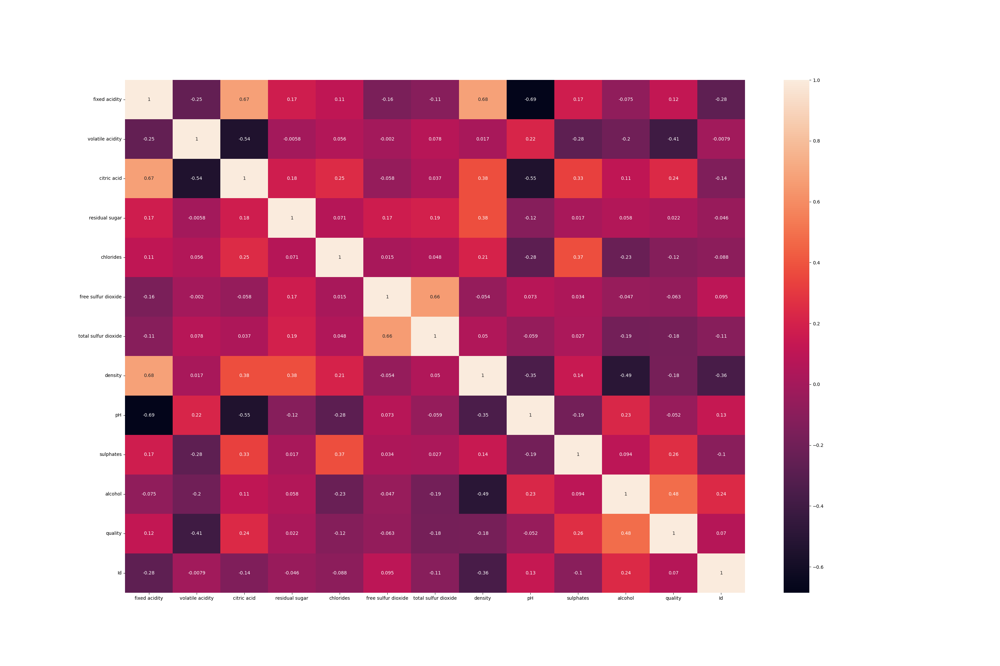

# Wine Quality Prediction

This project aims to predict the quality of wine based on various physicochemical properties using machine learning techniques.

## Table of Contents
- [Project Description](#project-description)
- [Dataset](#dataset)
- [Installation](#installation)
- [Workflow](#workflow)
- [Results](#results)
- [Technologies Used](#technologies-used)

---

## Project Description
The goal of this project is to build a classification model that can predict the quality of wine (on a scale of 3 to 8) based on several chemical features. This analysis can help wine producers understand the key factors that contribute to higher wine quality.

## Dataset
The dataset used in this project is `WineQT.csv`, which contains information on various chemical properties of wine.

### Features:
- **fixed acidity**: Amount of fixed acids in wine.
- **volatile acidity**: Amount of acetic acid in wine.
- **citric acid**: Amount of citric acid in wine.
- **residual sugar**: Amount of sugar remaining after fermentation stops.
- **chlorides**: Amount of salt in the wine.
- **free sulfur dioxide**: Free form of SO2.
- **total sulfur dioxide**: Total amount of SO2.
- **density**: Density of the wine.
- **pH**: Acidity or alkalinity of the wine.
- **sulphates**: Amount of sulfur dioxide gas (S02).
- **alcohol**: Alcohol content of the wine.

### Target Variable:
- **quality**: Wine quality score between 3 and 8.

## Installation
To run the notebook and reproduce the results, ensure you have Python installed along with the following libraries:

```bash
pip install pandas numpy matplotlib seaborn scikit-learn
```

## Workflow
1. **Data Loading**: Reading the `WineQT.csv` file using Pandas.
2. **Exploratory Data Analysis (EDA)**:
   - Initial data inspection using `head()`, `info()`, and `describe()`.
   - Checking for missing values.
   - Analyzing correlations between features using a heatmap.
3. **Data Splitting**: Dividing the data into features (`X`) and target variable (`y`), followed by a 70-30 train-test split.
4. **Model Building**: Training a `RandomForestClassifier` with 100 estimators.
5. **Evaluation**: Assessing the model's performance using the accuracy score.

## Results
The model achieves an **Accuracy Score of approximately 0.68 (68%)** on the test set.



## Technologies Used
- **Python**: Core programming language.
- **Pandas**: Data manipulation and analysis.
- **NumPy**: Numerical computing.
- **Matplotlib & Seaborn**: Data visualization.
- **Scikit-learn**: Machine learning model development and evaluation.
